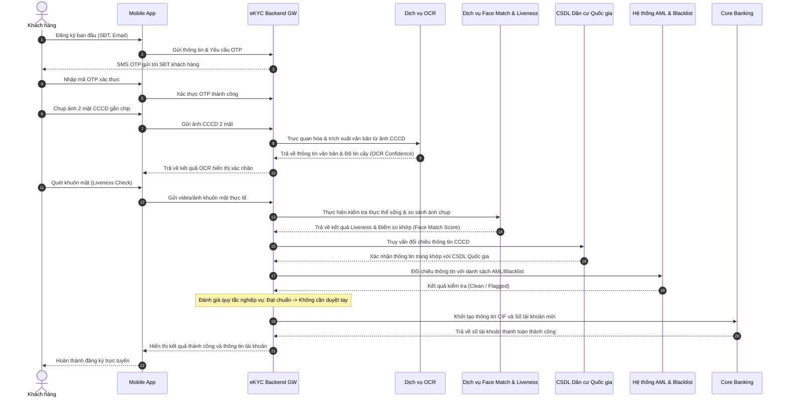

# TÀI LIỆU YÊU CẦU NGHIỆP VỤ (BRD)
## HỆ THỐNG MỞ TÀI KHOẢN NGÂN HÀNG TRỰC TUYẾN (eKYC) - ABC BANK

| Thuộc tính | Chi tiết |
| :--- | :--- |
| **Tên dự án** | Số hóa quy trình mở tài khoản trực tuyến (eKYC Onboarding) |
| **Chủ quản dự án** | Ngân hàng số ABC Bank |
| **Phiên bản tài liệu** | v1.0.0 |
| **Ngày cập nhật** | 03/07/2026 |
| **Trạng thái** | Hoàn thành phân tích (Approved) |
| **Tác giả** | Senior Business Analyst (FinTech Division) |

---

## 1. GIỚI THIỆU & MỤC TIÊU DỰ ÁN

### 1.1. Bối cảnh dự án
Nhằm gia tăng năng lực cạnh tranh trong kỷ nguyên số, ABC Bank mong muốn tối ưu hóa trải nghiệm khách hàng ở khâu đầu tiên và quan trọng nhất: **Mở tài khoản thanh toán**. Quy trình truyền thống yêu cầu khách hàng di chuyển tới quầy giao dịch, điền tờ khai giấy và đợi giao dịch viên xác minh thông tin, dẫn tới chi phí vận hành cao và tỷ lệ bỏ cuộc lớn.

Giải pháp eKYC (Electronic Know Your Customer) trên ứng dụng di động sẽ cho phép khách hàng định danh và mở tài khoản từ xa mọi lúc mọi nơi.

### 1.2. Mục tiêu cốt lõi
*   **Zero manual operation (Không can thiệp thủ công):** Tự động hóa 100% việc trích xuất dữ liệu, kiểm tra khuôn mặt, kiểm tra gian lận và cấp số tài khoản. Giao dịch viên/Kiểm soát viên chỉ tham gia hậu kiểm theo tỷ lệ định trước hoặc khi hệ thống phát hiện rủi ro cao.
*   **Thời gian xử lý nhanh chóng:** Tổng thời gian từ lúc tải ứng dụng đến khi nhận số tài khoản hoạt động không quá 2 phút (Happy Path dưới 45 giây).
*   **Tối đa hóa tỷ lệ chuyển đổi:** Thiết kế giao diện thân thiện, giảm số bước nhập liệu thủ công nhờ công nghệ OCR và tích hợp dữ liệu quốc gia.

---

## 2. TÁC NHÂN HỆ THỐNG (ACTORS)

Hệ thống eKYC tương tác với các tác nhân trong và ngoài ngân hàng như sau:

| STT | Tác nhân (Actor) | Phân loại | Vai trò & Mô tả |
| :--- | :--- | :--- | :--- |
| 1 | **Khách hàng (Customer)** | Con người (Chủ thể) | Người dùng cuối sử dụng thiết bị di động để đăng ký mở tài khoản. |
| 2 | **Mobile App ABC Bank** | Hệ thống (Client) | Giao diện trên thiết bị di động của khách hàng, thực hiện chụp ảnh CCCD, quay video khuôn mặt và gửi dữ liệu về Backend. |
| 3 | **Hệ thống eKYC Backend** | Hệ thống (Core Engine) | Bộ xử lý trung tâm điều phối luồng nghiệp vụ, kiểm tra quy tắc, gọi API ngoài và lưu trữ dữ liệu tạm thời. |
| 4 | **Dịch vụ OCR (Third-party/Internal API)** | Hệ thống (Dịch vụ) | Nhận ảnh CCCD, nhận diện và trích xuất thông tin dạng văn bản (Họ tên, Số CCCD, Ngày sinh, Địa chỉ, Ngày cấp...). |
| 5 | **Dịch vụ Face Match & Liveness Check** | Hệ thống (Dịch vụ) | Xác thực video/ảnh khuôn mặt để đảm bảo là người thật đang thao tác (Liveness) và so sánh khuôn mặt với ảnh trên CCCD (Face Match). |
| 6 | **CSDL Dân cư Quốc gia (Bộ Công An)** | Hệ thống (External DB) | Cổng kết nối đối chiếu thông tin CCCD gắn chip để xác thực tính chính xác của tài liệu pháp lý. |
| 7 | **Hệ thống AML / PEP / Blacklist Check** | Hệ thống (Internal Security) | Đối chiếu thông tin khách hàng với danh sách rửa tiền (AML), danh sách chính trị gia (PEP) và danh sách đen nội bộ của ABC Bank. |
| 8 | **Hệ thống Core Banking** | Hệ thống (Internal) | Khởi tạo thông tin khách hàng (CIF) và số tài khoản thanh toán (Account) mới. |
| 9 | **Kiểm soát viên Vận hành (Ops Officer)** | Con người (Internal) | Thực hiện hậu kiểm hoặc phê duyệt thủ công đối với các ca eKYC bị chuyển luồng nghi vấn (luồng ngoại lệ). |

---

## 3. LUỒNG NGHIỆP VỤ CHI TIẾT (BUSINESS FLOW)

### 3.1. Luồng chính (Happy Path - Auto Onboarding)
1.  Khách hàng tải và mở ứng dụng ABC Bank.
2.  Khách hàng đăng ký SĐT và Email -> Xác thực OTP gửi qua SMS.
3.  Khách hàng chụp ảnh 2 mặt CCCD gắn chip (App hướng dẫn tự động căn chỉnh góc).
4.  Hệ thống chạy OCR trích xuất dữ liệu và hiển thị lên màn hình để khách hàng xác nhận lại thông tin.
5.  Khách hàng thực hiện Liveness Check bằng cách quay/quét khuôn mặt theo chỉ dẫn (nhìn thẳng, quay trái/phải).
6.  Hệ thống tự động so khớp khuôn mặt với ảnh trên CCCD (Face Match) và gọi API đối chiếu Cơ sở dữ liệu dân cư quốc gia.
7.  Hệ thống chạy kiểm tra AML/PEP và kiểm tra trùng lặp thông tin khách hàng (khách hàng chưa từng có tài khoản tại ABC Bank).
8.  Hệ thống xác định tất cả thông số đều đạt chuẩn -> Gọi Core Banking tạo CIF & cấp Số tài khoản tự động.
9.  Hiển thị màn hình thông báo mở tài khoản thành công kèm thông tin tài khoản mới.

### 3.2. Luồng ngoại lệ & Cách xử lý (Exception Paths)
*   **Ngoại lệ 1 (Ảnh CCCD không hợp lệ):** Ảnh bị lóa, mờ, mất góc hoặc hết hạn. OCR trả về điểm tin cậy (Confidence Score) dưới 90%.
    *   *Xử lý:* Yêu cầu khách hàng chụp lại ngay lập tức. Sau 3 lần thất bại liên tiếp, từ chối luồng tự động và hướng dẫn ra quầy.
*   **Ngoại lệ 2 (Liveness Check thất bại):** Phát hiện giả mạo khuôn mặt (hình chụp lại từ màn hình, ảnh in, deepfake).
    *   *Xử lý:* Từ chối ngay lập tức và khóa tạm thời việc đăng ký trên thiết bị đó trong 24 giờ.
*   **Ngoại lệ 3 (Face Match Score thấp):** Điểm so khớp ảnh khuôn mặt thực tế và ảnh CCCD nằm trong khoảng nghi vấn [75% - 84%].
    *   *Xử lý:* Chuyển thông tin hồ sơ eKYC sang trạng thái "Chờ phê duyệt thủ công" (Pending Ops Review). Ops Officer sẽ thực hiện duyệt thủ công trên giao diện Back-Office trong vòng 15 phút. Nếu điểm dưới 75%, từ chối tự động.
*   **Ngoại lệ 4 (Phát hiện trùng lặp thông tin):** Khách hàng đã có mã CIF hoặc số CCCD đã được đăng ký tài khoản tại ABC Bank.
    *   *Xử lý:* Dừng luồng đăng ký mới. Hướng dẫn khách hàng đăng nhập hoặc lấy lại mật khẩu.
*   **Ngoại lệ 5 (Nằm trong AML/Blacklist):** Khách hàng trùng khớp thông tin trong danh sách cấm hoặc PEP cảnh báo cao.
    *   *Xử lý:* Chuyển luồng sang "Từ chối" hoặc chuyển trực tiếp cho Bộ phận Phòng chống rửa tiền (Compliance Ops) xử lý chuyên sâu, không cấp tài khoản tự động.

### 3.3. Sơ đồ tuần tự nghiệp vụ (Sequence Diagram)

---

## 4. YÊU CẦU CHỨC NĂNG (FUNCTIONAL REQUIREMENTS)

Hệ thống được chia nhỏ thành các phân hệ chức năng chính sau:

| ID Chức năng | Phân hệ chức năng | Mô tả yêu cầu |
| :--- | :--- | :--- |
| **FR-01** | **Xác thực Thông tin ban đầu** | Hệ thống phải tiếp nhận SĐT, Email và thực hiện gửi mã OTP 6 số qua SMS Brandname. Mã OTP có hiệu lực trong 3 phút, tối đa gửi lại 3 lần/24h. |
| **FR-02** | **Trích xuất thông tin OCR** | Hệ thống phải tự động nhận diện góc nghiêng, độ mờ/lóa của ảnh chụp CCCD. Trích xuất chính xác các trường dữ liệu bắt buộc (Số CCCD, Họ tên, Ngày sinh, Giới tính, Quê quán, Nơi thường trú, Ngày cấp, Ngày hết hạn). |
| **FR-03** | **Quét và Xác thực khuôn mặt** | Hệ thống phải thực hiện kiểm tra Liveness (yêu cầu khách hàng quay đầu, chớp mắt...) để chống gian lận bằng hình ảnh tĩnh. Thực hiện so sánh khuôn mặt thực tế với khuôn mặt trên CCCD. |
| **FR-04** | **So khớp CSDL Dân cư Quốc gia** | Tự động kết nối API Bộ Công An để xác định CCCD có đang hoạt động hay đã bị báo mất/hủy, và thông tin chủ thẻ trùng khớp hoàn toàn. |
| **FR-05** | **Kiểm tra Danh sách đen (AML Check)** | Tự động chạy quét tên, số giấy tờ tùy thân của khách hàng trên hệ thống sàng lọc AML (Anti-Money Laundering) và danh sách PEP (Politically Exposed Persons). |
| **FR-06** | **Tự động Khởi tạo Tài khoản** | Khi mọi kiểm tra eKYC thành công 100%, hệ thống tự động gọi Core Banking khởi tạo CIF mới và mở Tài khoản thanh toán mặc định cho khách hàng. |
| **FR-07** | **Quản lý phê duyệt (Ops Portal)** | Giao diện Back-office dành cho Kiểm soát viên phê duyệt các hồ sơ thuộc diện nghi vấn (Face Match điểm trung bình, OCR bị nghi ngờ sai lệch dấu từ ngữ). |

---

## 5. YÊU CẦU PHI CHỨC NĂNG (NON-FUNCTIONAL REQUIREMENTS)

Để đảm bảo hệ thống vận hành trơn tru và an toàn tuyệt đối, các yêu cầu phi chức năng sau đây bắt buộc phải được đáp ứng:

### 5.1. Bảo mật và Tuân thủ (Security & Compliance)
*   **Mã hóa dữ liệu:** Toàn bộ dữ liệu truyền tải giữa thiết bị di động, backend và bên thứ ba phải được mã hóa qua giao thức HTTPS/TLS 1.3. Dữ liệu nhạy cảm của khách hàng (Ảnh CCCD, Số CCCD, Ảnh chân dung) phải được mã hóa lưu trữ bằng thuật toán AES-256.
*   **Tuân thủ pháp lý:** Đáp ứng quy định về eKYC của Ngân hàng Nhà nước Việt Nam (Thông tư quy định về mở tài khoản thanh toán bằng phương thức điện tử) và Nghị định bảo vệ dữ liệu cá nhân (GDPR/Nghị định 13/2023/NĐ-CP).
*   **Lưu vết (Audit Trail):** Mọi thao tác ghi nhận kết quả từ hệ thống tự động hoặc quyết định phê duyệt thủ công của Ops phải được ghi log lịch sử không thể sửa xóa (Immutable Audit Log).

### 5.2. Hiệu năng và Khả năng xử lý (Performance & Latency)
*   **Thời gian phản hồi:**
    *   Thời gian trích xuất OCR: `< 2 giây` từ khi nhận ảnh.
    *   Thời gian kiểm tra Face Match & Liveness: `< 3 giây`.
    *   Tổng thời gian tự động cấp số tài khoản (từ khi gửi kết quả đối chiếu thành công đến Core Banking): `< 5 giây`.
*   **Khả năng chịu tải (Concurrency):** Hệ thống eKYC Backend phải hỗ trợ tối thiểu 200 lượt đăng ký đồng thời (TPS - Transactions Per Second) vào giờ cao điểm mà không tăng độ trễ xử lý.

### 5.3. Độ tin cậy và Tính sẵn sàng (Reliability & Availability)
*   **Uptime:** Độ sẵn sàng hoạt động của dịch vụ eKYC đạt tối thiểu `99.9%` (thời gian ngừng hoạt động không quá 8.76 giờ/năm).
*   **Phục hồi sau thảm họa (Disaster Recovery):** Hệ thống có cơ chế tự động chuyển đổi sang máy chủ dự phòng (Failover) tại Site DR khi Site chính gặp sự cố với mục tiêu RTO < 5 phút, RPO < 10 giây.

### 5.4. Trải nghiệm người dùng (Usability)
*   **Thiết kế thông minh:** Có hỗ trợ hướng dẫn bằng giọng nói (Voice Guidance) và phản hồi rung trên thiết bị di động để người dùng chụp ảnh/quét khuôn mặt đúng quy chuẩn.
*   **Hỗ trợ đa nền tảng:** Hoạt động ổn định trên cả hệ điều hành iOS (phiên bản 14 trở lên) và Android (phiên bản 8 trở lên).

---

## 6. GIẢ ĐỊNH & QUY TẮC NGHIỆP VỤ (ASSUMPTIONS & BUSINESS RULES)

### 6.1. Quy tắc quyết định eKYC tự động (Auto-Decision Rules)

| Quy tắc / Tiêu chí | Ngưỡng điểm (Score) | Hành động hệ thống | Trạng thái phê duyệt |
| :--- | :--- | :--- | :--- |
| **OCR Confidence** | `>= 90%` | Chấp nhận dữ liệu trích xuất | Cho đi tiếp |
| | `< 90%` | Yêu cầu nhập/chụp lại | Từ chối tự động sau 3 lần |
| **Face Match Score** | `>= 85%` | Xác nhận khớp khuôn mặt | Duyệt tự động (Auto-approved) |
| | `[75% - 84%]` | Chuyển sang hàng đợi duyệt tay | Chờ phê duyệt (Pending Ops Review) |
| | `< 75%` | Hủy quy trình | Từ chối tự động (Auto-rejected) |
| **Liveness Check** | `Passed` | Hợp lệ | Cho đi tiếp |
| | `Failed` | Giả mạo | Từ chối tự động & Khóa thiết bị |
| **AML/PEP Check** | `Clean` | Hợp lệ | Cho đi tiếp |
| | `Match Found` | Phát hiện rủi ro | Từ chối tự động hoặc chuyển Compliance |

### 6.2. Quy tắc hạn mức giao dịch (Transaction Limit Rules)
*   Theo quy định của Ngân hàng Nhà nước, tài khoản thanh toán mở trực tuyến qua phương thức eKYC (không gặp mặt trực tiếp) sẽ bị giới hạn tổng hạn mức giao dịch (ghi nợ) tối đa là **100 triệu VND/tháng/khách hàng**.
*   *Mở rộng hạn mức:* Để nâng hạn mức giao dịch, khách hàng bắt buộc phải thực hiện một trong các bước bổ sung:
    1.  Xác thực NFC chip CCCD qua ứng dụng di động thành công (Nâng lên 500 triệu/tháng).
    2.  Ký hợp đồng dịch vụ bằng Chữ ký số (Digital Signature).
    3.  Đến quầy giao dịch trực tiếp để nhân viên xác minh lại danh tính (Không giới hạn hạn mức mặc định).

---

## 7. DANH SÁCH USER STORIES

Dưới đây là danh sách các User Stories chính phục vụ cho quá trình phát triển sản phẩm của đội dự án:

### US-01: Xác thực OTP đăng ký ban đầu
*   **User Story:** As a new customer, I want to receive and verify a SMS OTP during registration so that the bank can verify my mobile phone number is active and belongs to me.
*   **Acceptance Criteria:**
    *   *Given* I have entered my phone number and email on the registration screen,
    *   *When* I click "Continue",
    *   *Then* the system generates a 6-digit OTP, sends it via SMS, and redirects me to the OTP input screen.
    *   *Given* I am on the OTP screen,
    *   *When* I enter the correct OTP within 3 minutes,
    *   *Then* the system verifies it and takes me to the identity document scan screen.
    *   *Given* I enter the incorrect OTP,
    *   *When* the verification fails,
    *   *Then* the system displays an error message "Mã OTP không chính xác" and allows retry. Max 3 retries.

### US-02: Chụp ảnh & OCR CCCD tự động
*   **User Story:** As a new customer, I want to scan my CCCD chip card using the mobile app camera so that I don't have to fill in all personal details manually.
*   **Acceptance Criteria:**
    *   *Given* I am on the document scanning screen,
    *   *When* I hold my CCCD in front of the camera,
    *   *Then* the app automatically detects boundaries, captures both front and back sides, and sends them to the OCR engine.
    *   *Given* the OCR engine processes the images successfully,
    *   *When* it returns a confidence score `>= 90%`,
    *   *Then* it auto-populates the confirmation screen with: Full name, Date of birth, CCCD number, Gender, Issue date, and Expiry date.

### US-03: Xác thực sinh trắc học (Liveness Check & Face Match)
*   **User Story:** As a bank compliance officer, I want the system to perform a liveness check and face comparison of the user registration so that we ensure the customer is a real person and matches the CCCD document holder.
*   **Acceptance Criteria:**
    *   *Given* the user has confirmed their OCR data,
    *   *When* the user completes facial scanning directions on the screen (e.g. smile, blink, turn head),
    *   *Then* the system verifies that the image is from a live subject (Liveness check passed) and compares it with the CCCD photo.
    *   *Given* the Match Score is `>= 85%`,
    *   *When* the Liveness status is "Passed",
    *   *Then* the system marks this verification step as "Passed" and proceeds automatically.

### US-04: Đối chiếu Cơ sở dữ liệu quốc gia & AML
*   **User Story:** As a risk manager, I want the system to check the customer against national databases and AML blacklists so that we can prevent fraud and identity theft automatically without manual checks.
*   **Acceptance Criteria:**
    *   *Given* the user passes facial verification,
    *   *When* the system queries the National Citizen database and the AML Blacklist system using the customer's CCCD number and name,
    *   *Then* it confirms that the identity exists, is valid, and does not match any profile in the PEP/AML blacklist.

### US-05: Tự động khởi tạo tài khoản (CIF & Account Provisioning)
*   **User Story:** As a new customer, I want my bank account to be created automatically right after my identity is confirmed so that I can start using digital banking services immediately.
*   **Acceptance Criteria:**
    *   *Given* all validations (OCR, Liveness, Face Match, National DB, AML) are "Passed" automatically,
    *   *When* the transaction reaches the provisioning stage,
    *   *Then* the eKYC system calls Core Banking APIs to create a CIF customer record and a payment account, setting the default transaction limit of 100M VND/month, and displays the success screen to the user.

---

## 8. DANH SÁCH USE CASES

### UC-01: Đăng ký tài khoản trực tuyến eKYC
*   **Tên Use Case:** Đăng ký tài khoản trực tuyến qua eKYC (Online Account Registration).
*   **Mô tả:** Khách hàng tự thực hiện quy trình định danh và mở tài khoản hoàn toàn tự động trên Mobile App.
*   **Tác nhân chính:** Khách hàng.
*   **Điều kiện tiên quyết:** Khách hàng chưa có tài khoản tại ABC Bank, có điện thoại kết nối mạng, có CCCD gắn chip hợp lệ.
*   **Kết quả đạt được (Post-conditions):** CIF được tạo, số tài khoản được cấp tự động, thông tin đăng nhập Mobile App được gửi về cho khách hàng.
*   **Luồng xử lý chính (Happy Path):**
    1.  Khách hàng khởi chạy ứng dụng và chọn "Mở tài khoản trực tuyến".
    2.  Hệ thống yêu cầu nhập Số điện thoại, Email.
    3.  Hệ thống gửi mã OTP, khách hàng nhập OTP để xác thực SĐT.
    4.  Khách hàng thực hiện chụp mặt trước và mặt sau CCCD gắn chip.
    5.  Hệ thống OCR trích xuất thông tin, khách hàng xác nhận lại thông tin chính xác.
    6.  Khách hàng quét khuôn mặt thực tế (Liveness check).
    7.  Hệ thống đối chiếu khuôn mặt, dữ liệu dân cư và kiểm tra danh sách đen (AML).
    8.  Hệ thống ghi nhận kết quả đạt chuẩn -> Gọi Core Banking tạo CIF & Số tài khoản.
    9.  Hệ thống hiển thị màn hình chúc mừng mở tài khoản thành công kèm số tài khoản.
*   **Luồng ngoại lệ (Exceptions):**
    *   *6a. Phát hiện Liveness Check thất bại:* Hệ thống dừng luồng, báo lỗi thiết bị giả mạo và khóa lượt đăng ký trên thiết bị đó 24 giờ.
    *   *7a. Điểm Face Match nằm trong khoảng [75% - 84%]:* Hệ thống ghi nhận trạng thái hồ sơ là "Chờ phê duyệt thủ công", thông báo cho khách hàng quá trình mở tài khoản sẽ được phê duyệt và phản hồi trong 15 phút. Luồng công việc được đẩy vào hàng chờ duyệt của Kiểm soát viên.

### UC-02: Phê duyệt hồ sơ eKYC nghi vấn (Ops Portal)
*   **Tên Use Case:** Phê duyệt hồ sơ eKYC nghi vấn (Approve Pending eKYC).
*   **Mô tả:** Kiểm soát viên rà soát các ca eKYC bị hệ thống đánh giá nằm trong diện nghi vấn (điểm so khớp khuôn mặt trung bình hoặc lỗi OCR nhẹ) để quyết định phê duyệt hoặc từ chối.
*   **Tác nhân chính:** Kiểm soát viên Vận hành (Ops Officer).
*   **Điều kiện tiên quyết:** Hồ sơ eKYC của khách hàng bị chuyển luồng "Chờ phê duyệt thủ công".
*   **Kết quả đạt được (Post-conditions):** Hồ sơ được duyệt (tài khoản được kích hoạt) hoặc bị từ chối mở tài khoản.
*   **Luồng xử lý chính (Happy Path):**
    1.  Kiểm soát viên đăng nhập vào hệ thống Ops Portal.
    2.  Hệ thống hiển thị danh sách hồ sơ "Chờ phê duyệt".
    3.  Kiểm soát viên chọn một hồ sơ nghi vấn để xem chi tiết.
    4.  Hệ thống hiển thị: Ảnh CCCD gốc, thông tin OCR trích xuất, ảnh chụp khuôn mặt thực tế của khách hàng, điểm Face Match (ví dụ: 78%) và nguyên nhân chuyển luồng nghi vấn.
    5.  Kiểm soát viên đối chiếu trực quan bằng mắt thường và xác nhận người thật trùng với CCCD.
    6.  Kiểm soát viên nhấn nút "Phê duyệt" (Approve).
    7.  Hệ thống gửi lệnh kích hoạt tài khoản sang Core Banking, đồng thời lưu lịch sử thao tác của Kiểm soát viên.
*   **Luồng ngoại lệ (Exceptions):**
    *   *5a. Kiểm soát viên nhận thấy khuôn mặt thực tế không khớp với ảnh CCCD:* Kiểm soát viên nhấn "Từ chối" (Reject), điền lý do "Khuôn mặt không khớp ảnh giấy tờ". Hệ thống hủy hồ sơ và gửi Email/SMS thông báo từ chối kích hoạt tài khoản tới khách hàng.
