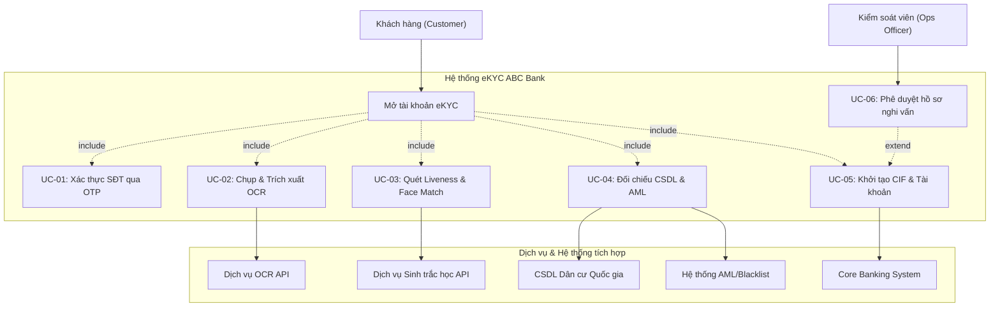

# TÀI LIỆU ĐẶC TẢ YÊU CẦU PHẦN MỀM (SRS)
## HỆ THỐNG MỞ TÀI KHOẢN NGÂN HÀNG TRỰC TUYẾN (eKYC) - ABC BANK

| Thuộc tính | Chi tiết |
| :--- | :--- |
| **Tên sản phẩm** | Phân hệ mở tài khoản trực tuyến eKYC (Onboarding eKYC Module) |
| **Tiêu chuẩn thiết lập** | IEEE Std 830-1998 (Software Requirements Specification) |
| **Phiên bản** | v1.0.0 |
| **Ngày cập nhật** | 03/07/2026 |
| **Trạng thái** | Phát hành chính thức (Released) |
| **Tác giả** | Senior Business Analyst / Technical Architect (ABC Bank FinTech Division) |

---

## PHẦN 1: GIỚI THIỆU CHUNG (INTRODUCTION)

### 1.1. Mục đích tài liệu (Purpose)
Tài liệu Đặc tả Yêu cầu Phần mềm (SRS) này mô tả chi tiết các yêu cầu chức năng và phi chức năng cho phân hệ mở tài khoản trực tuyến eKYC của ABC Bank. 
Tài liệu này được thiết kế và biên soạn làm cơ sở kỹ thuật thống nhất để bàn giao (Handover) và làm căn cứ làm việc cho:
*   **Đội ngũ Phát triển Phần mềm (Developers):** Thiết kế cấu trúc cơ sở dữ liệu, xây dựng API và giao diện Mobile App.
*   **Đội ngũ Đảm bảo chất lượng (QA/Testers):** Xây dựng kịch bản kiểm thử (Test Cases) và kiểm thử chất lượng phần mềm.
*   **Quản trị dự án (PMs/Stakeholders):** Kiểm soát tiến độ và đánh giá tính hoàn thiện của sản phẩm trước khi đưa vào vận hành.

### 1.2. Phạm vi hệ thống (System Scope)
Hệ thống eKYC là một phân hệ dịch vụ tích hợp trực tiếp trên ứng dụng di động (Mobile App) của ABC Bank và kết nối với các hệ thống backend nội bộ cùng các dịch vụ định danh của bên thứ ba.
*   **Phạm vi bao gồm:** 
    *   Giao diện người dùng trên Mobile App để đăng ký, chụp ảnh CCCD, và quét khuôn mặt sinh trắc học.
    *   Hệ thống trung gian API Gateway điều phối luồng và bảo mật thông tin.
    *   Các module tích hợp: OCR trích xuất thông tin, Face Match & Liveness Check, đối chiếu CSDL dân cư quốc gia, sàng lọc danh sách đen AML/PEP.
    *   Tự động mở mã CIF và số tài khoản thanh toán trên hệ thống Core Banking của ngân hàng.
    *   Giao diện quản trị Back-Office (Ops Portal) dành cho nhân viên vận hành xử lý các ca lỗi nghiệp vụ nhẹ.
*   **Phạm vi không bao gồm:**
    *   Hạ tầng vật lý của Core Banking và hệ thống CSDL Dân cư Quốc gia của Bộ Công An.
    *   Quy trình phát hành thẻ vật lý sau khi mở tài khoản trực tuyến thành công.

### 1.3. Thuật ngữ và Từ viết tắt (Definitions, Acronyms, and Abbreviations)

| Thuật ngữ | Tên đầy đủ | Định nghĩa nghiệp vụ / kỹ thuật |
| :--- | :--- | :--- |
| **eKYC** | Electronic Know Your Customer | Định danh khách hàng bằng phương thức điện tử từ xa không cần gặp mặt trực tiếp. |
| **OCR** | Optical Character Recognition | Công nghệ nhận diện và chuyển đổi ký tự quang học từ hình ảnh sang văn bản. |
| **Liveness Check** | Liveness Detection | Công nghệ kiểm tra thực thể sống để đảm bảo hình ảnh khuôn mặt được ghi nhận từ người thật đang thao tác, không phải ảnh chụp lại hay video deepfake. |
| **Face Match** | Facial Comparison | Công nghệ so sánh, đối chiếu mức độ tương đồng giữa hai hình ảnh khuôn mặt khác nhau để xác định xem có phải là cùng một người hay không. |
| **CIF** | Customer Information File | Mã định danh hồ sơ thông tin khách hàng duy nhất trong hệ thống Core Banking của ngân hàng. |
| **AML** | Anti-Money Laundering | Quy trình và bộ lọc phòng chống rửa tiền theo quy định pháp luật. |
| **PEP** | Politically Exposed Persons | Danh sách những cá nhân có ảnh hưởng chính trị, thuộc nhóm đối tượng có rủi ro cao về tham nhũng và rửa tiền. |
| **OTP** | One-Time Password | Mật khẩu sử dụng một lần, dùng để xác thực quyền sở hữu số điện thoại đăng ký. |
| **SDK** | Software Development Kit | Bộ công cụ phát triển phần mềm được tích hợp vào ứng dụng di động để hỗ trợ các chức năng chuyên biệt (như chụp ảnh CCCD, quét khuôn mặt). |
| **TPS** | Transactions Per Second | Số lượng giao dịch xử lý thành công trên hệ thống trong một giây. |

---

## PHẦN 2: MÔ TẢ TỔNG QUAN (OVERALL DESCRIPTION)

### 2.1. Góc nhìn sản phẩm (Product Perspective)
Hệ thống eKYC hoạt động như một dịch vụ lõi trung gian kết nối giao diện ứng dụng di động (Client) với các hệ thống hạ tầng ngân hàng và các dịch vụ xác thực bên thứ ba. Mô hình kiến trúc tổng quan được thể hiện qua các kết nối sau:

```
[Mobile App ABC Bank] <---> [eKYC Gateway]
                               |
       +-----------------------+-----------------------+
       |                       |                       |
[Dịch vụ OCR/Face Match]  [Core Banking]   [CSDL Dân cư Quốc gia / AML]
```

Hệ thống eKYC Gateway tiếp nhận yêu cầu từ Mobile App, chia nhỏ dữ liệu để gửi đi xác thực độc lập tại các phân hệ chuyên trách, tổng hợp kết quả, thực thi quy tắc quyết định (Decision Engine) và giao tiếp với Core Banking để tự động kích hoạt tài khoản.

### 2.2. Phân lớp người dùng và Đặc tính (User Classes and Characteristics)
Hệ thống phục vụ hai nhóm đối tượng người dùng chính:

*   **Khách hàng cá nhân (End Users):**
    *   *Đặc điểm:* Là công dân Việt Nam từ đủ 15 tuổi trở lên, có nhu cầu mở tài khoản ngân hàng.
    *   *Yêu cầu kỹ năng:* Không đòi hỏi kiến thức công nghệ cao. Hệ thống cần giao diện tối giản, chỉ dẫn trực quan bằng hình ảnh/âm thanh và thông báo lỗi rõ ràng dễ hiểu.
*   **Kiểm soát viên Vận hành (Ops Officers):**
    *   *Đặc điểm:* Nhân viên nghiệp vụ của ABC Bank có nghiệp vụ kiểm soát rủi ro và xác minh danh tính.
    *   *Yêu cầu kỹ năng:* Được đào tạo chuyên sâu về quy trình vận hành và kiểm tra gian lận giấy tờ tùy thân. Tương tác với hệ thống qua cổng quản trị Back-Office (Ops Portal) để phê duyệt các hồ sơ eKYC nghi vấn.

### 2.3. Ràng buộc hệ thống (Constraints)
*   **Ràng buộc pháp lý:**
    *   Tuân thủ nghiêm ngặt **Thông tư của Ngân hàng Nhà nước Việt Nam** hướng dẫn về việc mở và sử dụng tài khoản thanh toán bằng phương thức điện tử.
    *   Tuân thủ **Nghị định số 13/2023/NĐ-CP** về Bảo vệ dữ liệu cá nhân (GDPR của Việt Nam): Dữ liệu sinh trắc học và thông tin CCCD chỉ được sử dụng cho mục đích xác thực đăng ký và không được chia sẻ trái phép.
*   **Ràng buộc công nghệ & Hạ tầng:**
    *   Thiết bị di động của khách hàng phải có camera hoạt động tốt với độ phân giải tối thiểu 5.0 Megapixels.
    *   Hệ thống phụ thuộc vào tính sẵn sàng của các API bên thứ ba (Dịch vụ kết nối CSDL dân cư quốc gia của Bộ Công An). Bất kỳ sự cố gián đoạn kết nối nào từ phía đối tác sẽ ảnh hưởng trực tiếp đến kết quả eKYC.

---

## PHẦN 3: YÊU CẦU CHỨC NĂNG CHI TIẾT (SPECIFIC FUNCTIONAL REQUIREMENTS)

### 3.1. Module 1: Đăng ký thông tin ban đầu & Xác thực OTP
*   **Mô tả:** Tiếp nhận thông tin liên lạc cơ bản và xác thực số điện thoại di động chính chủ.
*   **Yêu cầu chi tiết:**

| Thành phần | Đặc tả yêu cầu kỹ thuật |
| :--- | :--- |
| **Input** | - Số điện thoại di động (định dạng 10 chữ số Việt Nam, kiểm tra đầu số nhà mạng).<br/>- Địa chỉ Email (đúng cú pháp email). |
| **Process** | 1. Hệ thống kiểm tra số điện thoại có đang liên kết với CIF nào đang hoạt động trên hệ thống chưa. Nếu đã có, báo trùng và dừng luồng.<br/>2. Sinh mã OTP ngẫu nhiên gồm 6 chữ số.<br/>3. Gọi API SMS Gateway gửi OTP tới số điện thoại của người dùng.<br/>4. Người dùng nhập mã OTP trên màn hình ứng dụng.<br/>5. Hệ thống đối chiếu mã nhập vào và thời gian hiệu lực (3 phút). |
| **Output** | - Bản ghi đăng ký tạm thời với trạng thái: `OTP_VERIFIED`.<br/>- Mã thông báo phiên (Session Token) để chuyển bước chụp ảnh CCCD. |

### 3.2. Module 2: Upload & Đọc CCCD (OCR)
*   **Mô tả:** Chụp ảnh hai mặt thẻ CCCD gắn chip và trích xuất dữ liệu tự động.
*   **Yêu cầu chi tiết:**

| Thành phần | Đặc tả yêu cầu kỹ thuật |
| :--- | :--- |
| **Input** | - Ảnh chụp mặt trước của thẻ CCCD gắn chip.<br/>- Ảnh chụp mặt sau của thẻ CCCD gắn chip. |
| **Process** | 1. Hệ thống Client-side thực hiện kiểm tra chất lượng ảnh thời gian thực (độ sáng, độ sắc nét, không bị mất góc, không bị lóa sáng).<br/>2. Gửi ảnh lên server eKYC để gọi dịch vụ OCR.<br/>3. OCR trích xuất các trường dữ liệu bắt buộc.<br/>4. Hệ thống kiểm tra hạn sử dụng của thẻ CCCD (so sánh Ngày hết hạn với ngày hiện tại).<br/>5. Trả kết quả về App hiển thị dưới dạng biểu mẫu xác nhận thông tin. |
| **Output** | - Bộ dữ liệu văn bản trích xuất: Họ tên, Số CCCD, Ngày sinh, Giới tính, Quê quán, Địa chỉ thường trú, Ngày cấp, Nơi cấp.<br/>- Điểm tin cậy (OCR Confidence Score) cho từng trường và điểm trung bình toàn bộ thẻ. |

### 3.3. Module 3: Xác thực khuôn mặt (Face Verification & Liveness Check)
*   **Mô tả:** Xác định khách hàng thao tác là người thật và trùng khớp với ảnh trên giấy tờ tùy thân.
*   **Yêu cầu chi tiết:**

| Thành phần | Đặc tả yêu cầu kỹ thuật |
| :--- | :--- |
| **Input** | - Video selfie ngắn (độ dài 3-5 giây) hoặc chuỗi ảnh chụp chuyển động khuôn mặt.<br/>- Ảnh chân dung trích xuất từ thẻ CCCD (lấy từ kết quả OCR). |
| **Process** | 1. Hệ thống phân tích video selfie qua thuật toán Liveness Detection để đảm bảo không có dấu hiệu giả tạo (ảnh chụp lại, video phát lại trên màn hình, mặt nạ 3D hoặc deepfake).<br/>2. So sánh đặc trưng hình học của khuôn mặt trong video selfie với khuôn mặt trên CCCD để tính điểm tương đồng (Face Match Score).<br/>3. Đánh giá kết quả dựa trên các ngưỡng nghiệp vụ quy định. |
| **Output** | - Trạng thái Liveness: `Passed` hoặc `Failed`.<br/>- Điểm so khớp khuôn mặt (Face Match Score - tỷ lệ % trùng khớp). |

### 3.4. Module 4: Kích hoạt tài khoản (Account Provisioning & Core Integration)
*   **Mô tả:** Thực hiện đối chiếu danh tính quốc gia, lọc rửa tiền và tự động khởi tạo tài khoản ngân hàng.
*   **Yêu cầu chi tiết:**

| Thành phần | Đặc tả yêu cầu kỹ thuật |
| :--- | :--- |
| **Input** | - Dữ liệu văn bản OCR đã được khách hàng xác nhận.<br/>- Mã định danh sinh trắc học và ảnh chân dung khách hàng.<br/>- Session Token hợp lệ của phiên làm việc. |
| **Process** | 1. Hệ thống eKYC gọi API CSDL Dân cư Quốc gia gửi thông tin đối chiếu. Nếu dữ liệu không trùng khớp, chuyển luồng lỗi.<br/>2. Gọi API hệ thống AML/PEP sàng lọc. Nếu trùng danh sách đen hoặc danh sách cảnh báo cao, dừng luồng tự động.<br/>3. Nếu tất cả kiểm tra đều đạt chuẩn (Auto-Approved): Gọi Core Banking API để tạo hồ sơ khách hàng mới (CIF) và mở Tài khoản thanh toán.<br/>4. Thiết lập hạn mức giao dịch ban đầu (100 triệu VND/tháng).<br/>5. Nếu nằm trong luồng nghi vấn (Pending Ops Review): Đẩy hồ sơ vào hàng đợi trên Portal chờ Ops duyệt thủ công. |
| **Output** | - Mã CIF khách hàng mới.<br/>- Số tài khoản thanh toán.<br/>- SMS/Email gửi thông tin tài khoản và mật khẩu đăng nhập tạm thời cho khách hàng. |

---

## PHẦN 4: YÊU CẦU PHI CHỨC NĂNG (NON-FUNCTIONAL REQUIREMENTS)

### 4.1. Yêu cầu bảo mật dữ liệu (Security Requirements)
*   **Mã hóa truyền tải:** Sử dụng giao thức HTTPS bảo mật kết hợp TLS 1.3 đối với tất cả các kết nối API Client-Server và Server-Server.
*   **Mã hóa lưu trữ:** Dữ liệu nhạy cảm (ảnh CCCD, ảnh chân dung khuôn mặt, thông tin định danh cá nhân) phải được mã hóa trước khi ghi xuống Cơ sở dữ liệu bằng thuật toán mã hóa đối xứng AES-256. Khóa mã hóa phải được quản lý bởi Module bảo mật phần cứng (HSM) hoặc dịch vụ quản lý khóa KMS của ngân hàng.
*   **Bảo mật ứng dụng (App Security):** Mobile App phải có cơ chế ngăn chặn ghi hình màn hình (Screen Recording Block) và chụp ảnh màn hình (Screenshot Block) trong suốt quá trình người dùng thực hiện các bước eKYC để tránh lộ thông tin.

### 4.2. Yêu cầu hiệu năng (Performance Requirements)
*   **Thời gian phản hồi API (API Response Time):**
    *   API xác thực mã OTP: `< 1.0 giây`.
    *   API trích xuất OCR CCCD: `< 2.0 giây` cho cả 2 mặt.
    *   API Liveness Check & Face Match: `< 3.0 giây`.
    *   API tạo CIF và cấp tài khoản trên Core Banking: `< 3.0 giây`.
*   **Khả năng chịu tải (Throughput):** Hệ thống eKYC phải xử lý đồng thời tối thiểu **200 giao dịch/giây (200 TPS)** mà không làm tăng thời gian phản hồi trung bình quá 15%.
*   **Tỷ lệ lỗi tối đa (Error Rate):** Tỷ lệ giao dịch lỗi do hệ thống (System Error Rate) không vượt quá **0.1%** trên tổng số giao dịch eKYC khởi tạo.

### 4.3. Yêu cầu tính sẵn sàng (Availability Requirements)
*   **Thời gian hoạt động liên tục (Uptime):** Hệ thống eKYC phải duy trì tính sẵn sàng hoạt động 24/7/365 với tỷ lệ tối thiểu đạt **99.9%** (tương đương tổng thời gian gián đoạn hệ thống do bảo trì hoặc sự cố không quá 43.8 phút/tháng).
*   **Dự phòng nóng (Active-Active DR):** Triển khai kiến trúc máy chủ dự phòng dạng Active-Active tại hai Trung tâm dữ liệu (DC - Data Center chính và DR - Disaster Recovery phụ). Khi DC gặp sự cố mất kết nối hoàn toàn, lưu lượng từ người dùng sẽ tự động chuyển hướng sang Site DR trong vòng dưới 30 giây (RTO < 30s) và không xảy ra mất mát dữ liệu giao dịch đang thực hiện (RPO = 0).

---

## PHẦN 5: SƠ ĐỒ TRỰC QUAN (VISUAL DIAGRAM)

Dưới đây là sơ đồ Use Case (Use Case Diagram) mô tả toàn bộ luồng tương tác giữa Khách hàng, Kiểm soát viên và các hệ thống nghiệp vụ tích hợp trong quá trình mở tài khoản eKYC:


