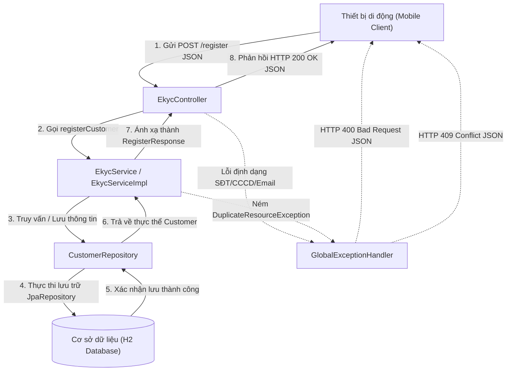

# FILE 02: TÀI LIỆU MÃ NGUỒN SPRING BOOT API eKYC

Tài liệu này chứa toàn bộ mã nguồn của dự án Spring Boot eKYC API, bao gồm cấu trúc thư mục, tệp cấu hình Maven, các lớp Java theo mô hình 3 lớp (MVC) và sơ đồ kiến trúc hệ thống.

---

## 1. SƠ ĐỒ KIẾN TRÚC HỆ THỐNG (SYSTEM ARCHITECTURE DIAGRAM)

Sơ đồ dưới đây mô tả luồng đi của dữ liệu từ ứng dụng di động khách hàng (Mobile Client) qua các lớp xử lý của Spring Boot đến cơ sở dữ liệu và cách hệ thống xử lý các luồng ngoại lệ (Validation, Trùng lặp):



---

## 2. CẤU TRÚC THƯ MỤC DỰ ÁN (PROJECT STRUCTURE)

```text
bai3/
├── pom.xml
└── src/
    └── main/
        ├── java/
        │   └── com/
        │       └── abcbank/
        │           └── ekyc/
        │               ├── EkycApplication.java
        │               ├── controller/
        │               │   └── EkycController.java
        │               ├── dto/
        │               │   ├── RegisterRequest.java
        │               │   └── RegisterResponse.java
        │               ├── exception/
        │               │   ├── DuplicateResourceException.java
        │               │   └── GlobalExceptionHandler.java
        │               ├── model/
        │               │   └── Customer.java
        │               ├── repository/
        │               │   └── CustomerRepository.java
        │               └── service/
        │                   ├── EkycService.java
        │                   └── impl/
        │                       └── EkycServiceImpl.java
        └── resources/
            └── application.properties
```

---

## 3. CHI TIẾT MÃ NGUỒN CÁC TỆP TIN

### 3.1. Cấu hình Maven: `pom.xml`
```xml
<?xml version="1.0" encoding="UTF-8"?>
<project xmlns="http://maven.apache.org/POM/4.0.0" 
         xmlns:xsi="http://www.w3.org/2001/XMLSchema-instance"
         xsi:schemaLocation="http://maven.apache.org/POM/4.0.0 https://maven.apache.org/xsd/maven-4.0.0.xsd">
    <modelVersion>4.0.0</modelVersion>
    <parent>
        <groupId>org.springframework.boot</groupId>
        <artifactId>spring-boot-starter-parent</artifactId>
        <version>3.2.5</version>
        <relativePath/> <!-- lookup parent from repository -->
    </parent>
    <groupId>com.abcbank</groupId>
    <artifactId>ekyc</artifactId>
    <version>0.0.1-SNAPSHOT</version>
    <name>ekyc</name>
    <description>eKYC Account Registration API for ABC Bank</description>
    <properties>
        <java.version>17</java.version>
    </properties>
    <dependencies>
        <!-- Web API Starter -->
        <dependency>
            <groupId>org.springframework.boot</groupId>
            <artifactId>spring-boot-starter-web</artifactId>
        </dependency>
        <!-- JPA Hibernate Database Starter -->
        <dependency>
            <groupId>org.springframework.boot</groupId>
            <artifactId>spring-boot-starter-data-jpa</artifactId>
        </dependency>
        <!-- Data Validation Starter -->
        <dependency>
            <groupId>org.springframework.boot</groupId>
            <artifactId>spring-boot-starter-validation</artifactId>
        </dependency>
        <!-- In-memory H2 Database for Development -->
        <dependency>
            <groupId>com.h2database</groupId>
            <artifactId>h2</artifactId>
            <scope>runtime</scope>
        </dependency>
        <!-- Lombok to reduce boilerplate code -->
        <dependency>
            <groupId>org.projectlombok</groupId>
            <artifactId>lombok</artifactId>
            <optional>true</optional>
        </dependency>
    </dependencies>

    <build>
        <plugins>
            <plugin>
                <groupId>org.springframework.boot</groupId>
                <artifactId>spring-boot-maven-plugin</artifactId>
                <configuration>
                    <excludes>
                        <exclude>
                            <groupId>org.projectlombok</groupId>
                            <artifactId>lombok</artifactId>
                        </exclude>
                    </excludes>
                </configuration>
            </plugin>
        </plugins>
    </build>
</project>
```

### 3.2. Cấu hình ứng dụng: `application.properties`
```properties
# Port cấu hình chạy ứng dụng
server.port=8080

# Cấu hình Cơ sở dữ liệu tạm thời H2 chạy trên RAM
spring.datasource.url=jdbc:h2:mem:ekycdb;DB_CLOSE_DELAY=-1
spring.datasource.driverClassName=org.h2.Driver
spring.datasource.username=sa
spring.datasource.password=password
spring.jpa.database-platform=org.hibernate.dialect.H2Dialect

# Console quản trị H2 Database qua giao diện web (để debug)
spring.h2.console.enabled=true
spring.h2.console.path=/h2-console

# Show SQL log khi thực thi JPA
spring.jpa.show-sql=true
spring.jpa.hibernate.ddl-auto=update
```

### 3.3. Lớp chạy chính: `EkycApplication.java`
```java
package com.abcbank.ekyc;

import org.springframework.boot.SpringApplication;
import org.springframework.boot.autoconfigure.SpringBootApplication;

/**
 * <h1>EkycApplication</h1>
 * Lớp khởi chạy ứng dụng eKYC API của ngân hàng số ABC Bank.
 */
@SpringBootApplication
public class EkycApplication {
    public static void main(String[] args) {
        SpringApplication.run(EkycApplication.class, args);
    }
}
```

### 3.4. Tầng Dữ liệu (Entity): `Customer.java`
```java
package com.abcbank.ekyc.model;

import jakarta.persistence.*;
import lombok.*;
import java.time.LocalDateTime;
import java.util.UUID;

/**
 * <h1>Customer Entity</h1>
 * Đại diện cho bảng 'customers' lưu trữ thông tin định danh và tài khoản eKYC.
 */
@Entity
@Table(name = "customers")
@Data
@NoArgsConstructor
@AllArgsConstructor
@Builder
public class Customer {

    @Id
    @GeneratedValue(strategy = GenerationType.UUID)
    private UUID id;

    @Column(name = "full_name", nullable = false)
    private String fullName;

    @Column(name = "phone", nullable = false, unique = true)
    private String phone;

    @Column(name = "email", nullable = false, unique = true)
    private String email;

    @Column(name = "citizen_id", nullable = false, unique = true, length = 12)
    private String citizenId;

    @Column(name = "account_number", nullable = false, unique = true)
    private String accountNumber;

    @Column(name = "status", nullable = false)
    private String status; // ACTIVE, PENDING, REJECTED

    @Column(name = "created_at", nullable = false)
    private LocalDateTime createdAt;

    @PrePersist
    protected void onCreate() {
        this.createdAt = LocalDateTime.now();
    }
}
```

### 3.5. Lớp truyền nhận DTOs: `RegisterRequest.java` và `RegisterResponse.java`
#### `RegisterRequest.java`
```java
package com.abcbank.ekyc.dto;

import jakarta.validation.constraints.Email;
import jakarta.validation.constraints.NotBlank;
import jakarta.validation.constraints.Pattern;
import lombok.AllArgsConstructor;
import lombok.Data;
import lombok.NoArgsConstructor;

/**
 * <h1>RegisterRequest DTO</h1>
 * Tiếp nhận thông tin đăng ký eKYC từ Client và thực thi kiểm tra hợp lệ dữ liệu.
 */
@Data
@NoArgsConstructor
@AllArgsConstructor
public class RegisterRequest {

    @NotBlank(message = "Họ và tên không được để trống")
    private String fullName;

    @NotBlank(message = "Số điện thoại không được để trống")
    @Pattern(regexp = "^(0|\\+84)[3|5|7|8|9][0-9]{8}$", 
             message = "Số điện thoại không đúng định dạng Việt Nam (ví dụ: 0912345678)")
    private String phone;

    @NotBlank(message = "Email không được để trống")
    @Email(message = "Địa chỉ email không đúng định dạng")
    private String email;

    @NotBlank(message = "Số CCCD không được để trống")
    @Pattern(regexp = "^[0-9]{12}$", 
             message = "Số CCCD phải bao gồm chính xác 12 chữ số")
    private String citizenId;
}
```

#### `RegisterResponse.java`
```java
package com.abcbank.ekyc.dto;

import lombok.AllArgsConstructor;
import lombok.Builder;
import lombok.Data;
import lombok.NoArgsConstructor;
import java.util.UUID;

/**
 * <h1>RegisterResponse DTO</h1>
 * Trả về kết quả sau khi đăng ký và định danh eKYC thành công.
 */
@Data
@NoArgsConstructor
@AllArgsConstructor
@Builder
public class RegisterResponse {
    private UUID accountId;
    private String accountNumber;
    private String status;
    private String message;
}
```

### 3.6. Tầng Truy cập Dữ liệu (Repository): `CustomerRepository.java`
```java
package com.abcbank.ekyc.repository;

import com.abcbank.ekyc.model.Customer;
import org.springframework.data.jpa.repository.JpaRepository;
import org.springframework.stereotype.Repository;
import java.util.UUID;

/**
 * <h1>CustomerRepository</h1>
 * Giao tiếp với Cơ sở dữ liệu để thực thi truy vấn thông tin Customer.
 */
@Repository
public interface CustomerRepository extends JpaRepository<Customer, UUID> {
    
    // Kiểm tra số điện thoại đã tồn tại chưa
    boolean existsByPhone(String phone);

    // Kiểm tra số CCCD đã tồn tại chưa
    boolean existsByCitizenId(String citizenId);
}
```

### 3.7. Tầng Nghiệp vụ (Service): `EkycService.java` và `EkycServiceImpl.java`
#### `EkycService.java`
```java
package com.abcbank.ekyc.service;

import com.abcbank.ekyc.dto.RegisterRequest;
import com.abcbank.ekyc.dto.RegisterResponse;

/**
 * <h1>EkycService Interface</h1>
 * Định nghĩa các nghiệp vụ cốt lõi của quy trình eKYC.
 */
public interface EkycService {
    /**
     * Thực hiện kiểm tra nghiệp vụ và đăng ký tài khoản khách hàng mới.
     * @param request dữ liệu đăng ký đầu vào
     * @return kết quả thông tin tài khoản được cấp tự động
     */
    RegisterResponse registerCustomer(RegisterRequest request);
}
```

#### `EkycServiceImpl.java`
```java
package com.abcbank.ekyc.service.impl;

import com.abcbank.ekyc.dto.RegisterRequest;
import com.abcbank.ekyc.dto.RegisterResponse;
import com.abcbank.ekyc.exception.DuplicateResourceException;
import com.abcbank.ekyc.model.Customer;
import com.abcbank.ekyc.repository.CustomerRepository;
import com.abcbank.ekyc.service.EkycService;
import lombok.RequiredArgsConstructor;
import org.springframework.stereotype.Service;
import java.util.Random;

/**
 * <h1>EkycServiceImpl</h1>
 * Triển khai các quy tắc nghiệp vụ định danh và tích hợp Core Banking cấp số tài khoản.
 */
@Service
@RequiredArgsConstructor
public class EkycServiceImpl implements EkycService {

    private final CustomerRepository customerRepository;

    @Override
    public CustomerRepository getRepository() {
        return customerRepository;
    }

    @Override
    public RegisterResponse registerCustomer(RegisterRequest request) {
        // Quy tắc 1: Kiểm tra trùng số điện thoại
        if (customerRepository.existsByPhone(request.getPhone())) {
            throw new DuplicateResourceException("Số điện thoại này đã được sử dụng trên hệ thống");
        }

        // Quy tắc 2: Kiểm tra trùng số CCCD
        if (customerRepository.existsByCitizenId(request.getCitizenId())) {
            throw new DuplicateResourceException("Số Căn cước công dân này đã được đăng ký tài khoản");
        }

        // Mô phỏng tích hợp hệ thống Core: sinh tự động Số tài khoản thanh toán
        // Quy tắc sinh: Bắt đầu bằng 999 và tiếp theo là 7 số ngẫu nhiên
        String generatedAccountNumber = generateAccountNumber();

        // Khởi tạo đối tượng Customer để lưu xuống Database
        // Luồng mặc định eKYC thành công tự động được đặt trạng thái ACTIVE
        Customer customer = Customer.builder()
                .fullName(request.getFullName())
                .phone(request.getPhone())
                .email(request.getEmail())
                .citizenId(request.getCitizenId())
                .accountNumber(generatedAccountNumber)
                .status("ACTIVE")
                .build();

        Customer savedCustomer = customerRepository.save(customer);

        // Trả về DTO chứa thông tin kết quả
        return RegisterResponse.builder()
                .accountId(savedCustomer.getId())
                .accountNumber(savedCustomer.getAccountNumber())
                .status(savedCustomer.getStatus())
                .message("Định danh eKYC và mở tài khoản trực tuyến thành công")
                .build();
    }

    /**
     * Hàm sinh số tài khoản ngẫu nhiên.
     */
    private String generateAccountNumber() {
        Random random = new Random();
        int suffix = 1000000 + random.nextInt(9000000); // 7 chữ số ngẫu nhiên
        return "999" + suffix;
    }
}
```

### 3.8. Tầng Giao tiếp (Controller): `EkycController.java`
```java
package com.abcbank.ekyc.controller;

import com.abcbank.ekyc.dto.RegisterRequest;
import com.abcbank.ekyc.dto.RegisterResponse;
import com.abcbank.ekyc.service.EkycService;
import jakarta.validation.Valid;
import lombok.RequiredArgsConstructor;
import org.springframework.http.HttpStatus;
import org.springframework.http.ResponseEntity;
import org.springframework.web.bind.annotation.*;

/**
 * <h1>EkycController</h1>
 * REST Controller tiếp nhận và định tuyến các luồng API liên quan đến eKYC.
 */
@RestController
@RequestMapping("/api/v1/ekyc")
@RequiredArgsConstructor
public class EkycController {

    private final EkycService ekycService;

    /**
     * Endpoint đăng ký tài khoản eKYC tự động.
     * Sử dụng @Valid để kích hoạt kiểm tra dữ liệu đầu vào.
     */
    @PostMapping("/register")
    public ResponseEntity<RegisterResponse> registerCustomer(@Valid @RequestBody RegisterRequest request) {
        RegisterResponse response = ekycService.registerCustomer(request);
        return new ResponseEntity<>(response, HttpStatus.CREATED);
    }
}
```

### 3.9. Xử lý ngoại lệ: `DuplicateResourceException.java` & `GlobalExceptionHandler.java`
#### `DuplicateResourceException.java`
```java
package com.abcbank.ekyc.exception;

/**
 * <h1>DuplicateResourceException</h1>
 * Ngoại lệ ném ra khi phát hiện trùng lặp tài nguyên (SĐT hoặc CCCD).
 */
public class DuplicateResourceException extends RuntimeException {
    public DuplicateResourceException(String message) {
        super(message);
    }
}
```

#### `GlobalExceptionHandler.java`
```java
package com.abcbank.ekyc.exception;

import org.springframework.http.HttpStatus;
import org.springframework.http.ResponseEntity;
import org.springframework.validation.FieldError;
import org.springframework.web.bind.MethodArgumentNotValidException;
import org.springframework.web.bind.annotation.ExceptionHandler;
import org.springframework.web.bind.annotation.RestControllerAdvice;
import java.time.LocalDateTime;
import java.util.HashMap;
import java.util.Map;

/**
 * <h1>GlobalExceptionHandler</h1>
 * Đánh chặn các ngoại lệ trên toàn hệ thống và định dạng lại cấu trúc lỗi trả về Client.
 */
@RestControllerAdvice
public class GlobalExceptionHandler {

    /**
     * Bắt lỗi xác thực dữ liệu đầu vào (@Valid).
     * Trả về danh sách lỗi chi tiết cho từng trường.
     */
    @ExceptionHandler(MethodArgumentNotValidException.class)
    public ResponseEntity<Map<String, Object>> handleValidationExceptions(MethodArgumentNotValidException ex) {
        Map<String, Object> body = new HashMap<>();
        body.put("timestamp", LocalDateTime.now());
        body.put("status", HttpStatus.BAD_REQUEST.value());
        body.put("error", "Bad Request");

        Map<String, String> errors = new HashMap<>();
        ex.getBindingResult().getAllErrors().forEach((error) -> {
            String fieldName = ((FieldError) error).getField();
            String errorMessage = error.getDefaultMessage();
            errors.put(fieldName, errorMessage);
        });
        body.put("details", errors);

        return new ResponseEntity<>(body, HttpStatus.BAD_REQUEST);
    }

    /**
     * Bắt lỗi trùng tài nguyên (SĐT / CCCD).
     */
    @ExceptionHandler(DuplicateResourceException.class)
    public ResponseEntity<Map<String, Object>> handleDuplicateResourceException(DuplicateResourceException ex) {
        Map<String, Object> body = new HashMap<>();
        body.put("timestamp", LocalDateTime.now());
        body.put("status", HttpStatus.CONFLICT.value());
        body.put("error", "Conflict");
        body.put("message", ex.getMessage());

        return new ResponseEntity<>(body, HttpStatus.CONFLICT);
    }

    /**
     * Bắt các ngoại lệ hệ thống không mong muốn khác.
     */
    @ExceptionHandler(Exception.class)
    public ResponseEntity<Map<String, Object>> handleGeneralException(Exception ex) {
        Map<String, Object> body = new HashMap<>();
        body.put("timestamp", LocalDateTime.now());
        body.put("status", HttpStatus.INTERNAL_SERVER_ERROR.value());
        body.put("error", "Internal Server Error");
        body.put("message", "Đã xảy ra lỗi hệ thống. Vui lòng thử lại sau.");

        return new ResponseEntity<>(body, HttpStatus.INTERNAL_SERVER_ERROR);
    }
}
```
